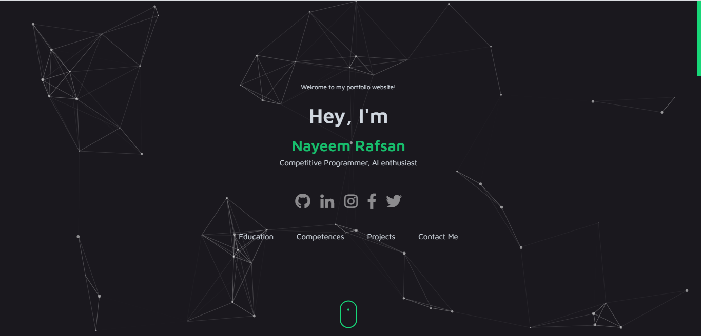
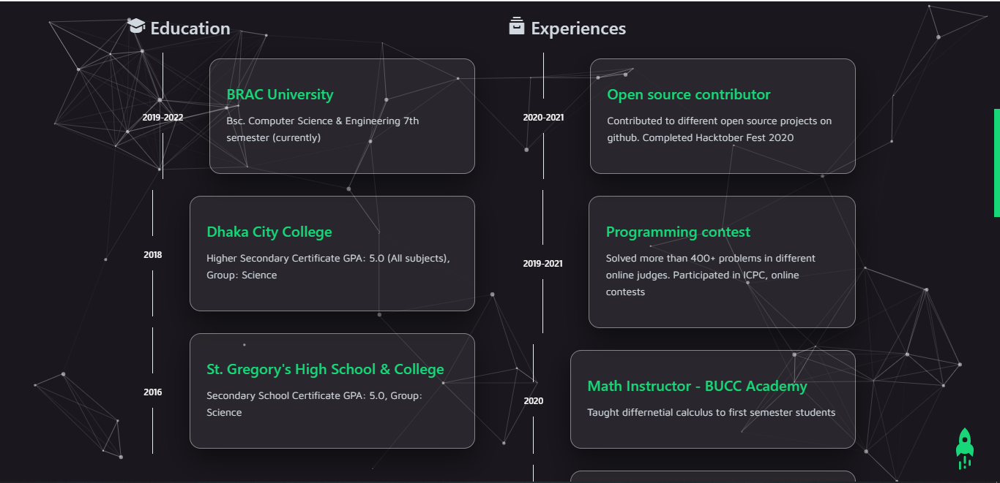
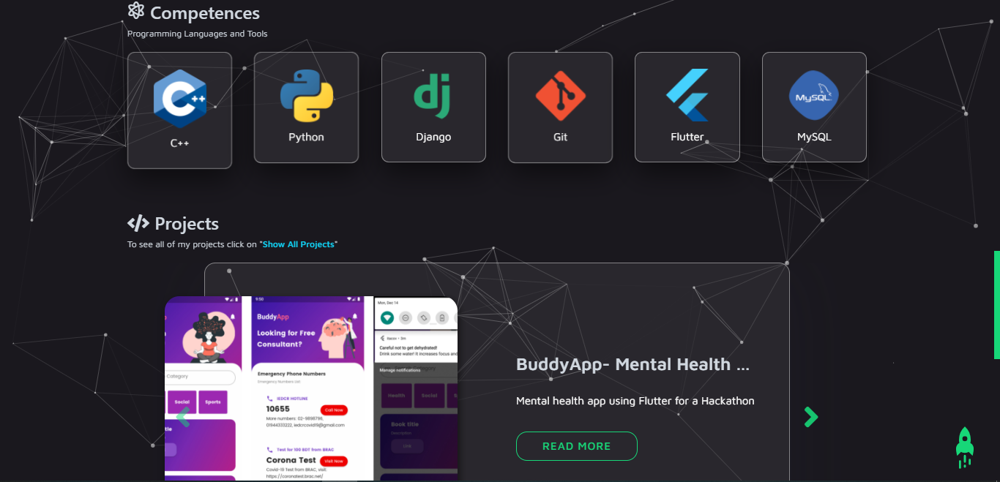

# Personal Portfolio Website

# live site: https://rafsan-portfolio.herokuapp.com/

Portfolio website using Django:

special thanks to for the template<a href="https://github.com/abdlalisalmi">Abdelaali ES SALMI</a>
